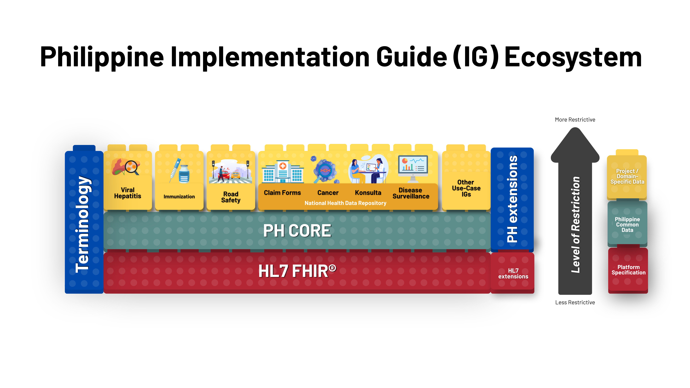

# Home - Draft PH Core Implementation Guide v0.2.0

## Home

# Draft Philippine Core FHIR Implementation Guide (PH Core IG)

> **Project Status: In Development**
 This Implementation Guide is under active development and is not yet available for public or production use. Content, data models, and implementation details are subject to change.

The Philippine Core FHIR Implementation Guide (PH Core IG) defines the nationally agreed core clinical and administrative data standards for interoperable health information exchange in the Philippines. It provides a common, implementable foundation for health systems to consistently exchange data using the HL7® FHIR® standard.

PH Core IG standardizes commonly used FHIR profiles, extensions, terminology bindings, and conformance expectations that are applicable across health programs, facilities, and systems nationwide. Program- or use case–specific IGs should use PH Core artifacts to avoid duplication and ensure nationwide interoperability.

# Project Background

PH Core is actively being developed by UP Manila National TeleHealth Center, under the guidance of the Phillippines Department of Health, with technical assistance from CSIRO Australia.

The initial draft of IG will be tested in the Connectathon to validate proof of concept and direction settings for the Philippines Core IG development process.

# Purpose and Scope

The PH Core IG aims to:

1. Promote nationwide consistency and interoperability of health data
1. Support alignment with national policies such as JAO 2021-0002
1. Enable reuse of HL7 and international FHIR artifacts
1. Provide clear, testable specifications for system implementers

This guide focuses on core clinical and administrative resources (e.g., Patient, Practitioner, Organization, Encounter, Observation) that are widely applicable across multiple use cases. It does not define program-specific workflows or reporting payloads, which are addressed by downstream Implementation Guides.

# Usage of this Guide

* Health information systems implement PH Core profiles as a baseline for interoperability
* Program-specific IGs inherit from PH Core and apply additional constraints
* Developers and vendors use the guide to build and validate FHIR-conformant systems
* Policy and governance bodies use it as a reference for national standardization

# Development and Governance

The PH Core IG is developed through a collaborative, open, and standards-based process, involving the Department of Health (DOH), PhilHealth, UP Manila, and key technical partners. Development follows international best practices, uses open-source tooling (FHIR Shorthand, GitHub, IG Publisher), and is governed through structured review and change control mechanisms.

# Relationship with other IGs

**PH Core:**

* defines a set of conformance requirements that enforce a set of ‘minimum requirements’ on the local concepts, specifying rules for the elements, extensions, vocabularies, and value sets, and the RESTful API interactions.
* for use by the stakeholders in the Philippines when implementing FHIR to provide a common implementation and to be built upon when creating further profiles and implementation guides.
* conformance may become tied to regulatory and/or contractual agreements in order to necessitate adoption to this more prescriptive specification.

The context of PH Core within the set of FHIR Standards is shown in the diagram below.

# Usage

PH Core is particularly useful in defining:

* A testable level of system conformance
* Assumed support by client applications
* The basis of downstream implementation guides

Implementation of capabilities defined in PH Core enables specifications, applications and business logic to be developed with confidence.

This document is a working specification that may be directly implemented by FHIR®© system producers.

FHIR®© Connectathon events are key to the verification of the guide as being suitable for implementation. This implementation guide will be used as the basis for the Philippines Connectathon events.

# Dependencies

This publication includes IP covered under the following statements.

* These codes are excerpted from ASTM Standard, E1762-95(2013) - Standard Guide for Electronic Authentication of Health Care Information, Copyright by ASTM International, 100 Barr Harbor Drive, West Conshohocken, PA 19428. Copies of this standard are available through the ASTM Web Site at www.astm.org.

* [Signature Type Codes](http://hl7.org/fhir/R4/codesystem-signature-type.html): [Provenance/provenance-single-example](Provenance-provenance-single-example.md)

* This material contains content from [LOINC](http://loinc.org). LOINC is copyright © 1995-2020, Regenstrief Institute, Inc. and the Logical Observation Identifiers Names and Codes (LOINC) Committee and is available at no cost under the [license](http://loinc.org/license). LOINC® is a registered United States trademark of Regenstrief Institute, Inc.

* LOINC: [Bundle/transaction-example](Bundle-transaction-example.md), [Observation/observation-based-on-service-example](Observation-observation-based-on-service-example.md)... Show 13 more, [Observation/observation-bp-example](Observation-observation-bp-example.md), [Observation/observation-derived-bmi-example](Observation-observation-derived-bmi-example.md), [Observation/observation-environmental-temp-example](Observation-observation-environmental-temp-example.md), [Observation/observation-glucose-example](Observation-observation-glucose-example.md), [Observation/observation-height-example](Observation-observation-height-example.md), [Observation/observation-lab-panel-example](Observation-observation-lab-panel-example.md), [Observation/observation-part-of-procedure-example](Observation-observation-part-of-procedure-example.md), [Observation/observation-performer-role-example](Observation-observation-performer-role-example.md), [Observation/observation-potassium-example](Observation-observation-potassium-example.md), [Observation/observation-sodium-example](Observation-observation-sodium-example.md), [Observation/observation-vitals-encounter-example](Observation-observation-vitals-encounter-example.md), [Observation/observation-weight-example](Observation-observation-weight-example.md) and [Practitioner/practitioner-single-example](Practitioner-practitioner-single-example.md)

* This material contains content that is copyright of SNOMED International. Implementers of these specifications must have the appropriate SNOMED CT Affiliate license - for more information contact [https://www.snomed.org/get-snomed](https://www.snomed.org/get-snomed) or [info@snomed.org](mailto:info@snomed.org).

* [SNOMED Clinical Terms&reg; (SNOMED CT&reg;)](http://hl7.org/fhir/R4/codesystem-snomedct.html): [AllergyIntolerance/allergy-single-example](AllergyIntolerance-allergy-single-example.md), [AllergyIntolerance/example-allergy](AllergyIntolerance-example-allergy.md)... Show 17 more, [Bundle/transaction-example](Bundle-transaction-example.md), [Claim/claim-single-example](Claim-claim-single-example.md), [Condition/condition-single-example](Condition-condition-single-example.md), [Condition/example-condition](Condition-example-condition.md), [Encounter/encounter-single-example](Encounter-encounter-single-example.md), [Immunization/immunization-single-example](Immunization-immunization-single-example.md), [Medication/medication-single-example](Medication-medication-single-example.md), [MedicationDispense/medicationdispense-single-example](MedicationDispense-medicationdispense-single-example.md), [MedicationRequest/medicationrequest-single-example](MedicationRequest-medicationrequest-single-example.md), [MedicationStatement/medicationstatement-single-example](MedicationStatement-medicationstatement-single-example.md), [Observation/observation-bp-example](Observation-observation-bp-example.md), [Outpatient Department - General Medicine](HealthcareService-healthcareservice-single-example.md), [Practitioner/practitioner-single-example](Practitioner-practitioner-single-example.md), [PractitionerRole/practitionerrole-single-example](PractitionerRole-practitionerrole-single-example.md), [Procedure/procedure-single-example](Procedure-procedure-single-example.md), [ServiceRequest/servicerequest-single-example](ServiceRequest-servicerequest-single-example.md) and [Task/task-single-example](Task-task-single-example.md)

* This material derives from the HL7 Terminology (THO). THO is copyright ©1989+ Health Level Seven International and is made available under the CC0 designation. For more licensing information see: [https://terminology.hl7.org/license.html](https://terminology.hl7.org/license.html)

* [AllergyIntolerance Clinical Status Codes](http://terminology.hl7.org/7.2.0/CodeSystem-allergyintolerance-clinical.html): [AllergyIntolerance/allergy-single-example](AllergyIntolerance-allergy-single-example.md), [AllergyIntolerance/example-allergy](AllergyIntolerance-example-allergy.md) and [Bundle/transaction-example](Bundle-transaction-example.md)
* [AllergyIntolerance Verification Status](http://terminology.hl7.org/7.2.0/CodeSystem-allergyintolerance-verification.html): [AllergyIntolerance/allergy-single-example](AllergyIntolerance-allergy-single-example.md) and [Bundle/transaction-example](Bundle-transaction-example.md)
* [Claim Type Codes](http://terminology.hl7.org/7.2.0/CodeSystem-claim-type.html): [Claim/claim-single-example](Claim-claim-single-example.md)
* [Claim Care Team Role Codes](http://terminology.hl7.org/7.2.0/CodeSystem-claimcareteamrole.html): [Claim/claim-single-example](Claim-claim-single-example.md)
* [Condition Category Codes](http://terminology.hl7.org/7.2.0/CodeSystem-condition-category.html): [Bundle/transaction-example](Bundle-transaction-example.md) and [Condition/condition-single-example](Condition-condition-single-example.md)
* [Condition Clinical Status Codes](http://terminology.hl7.org/7.2.0/CodeSystem-condition-clinical.html): [Bundle/transaction-example](Bundle-transaction-example.md), [Condition/condition-single-example](Condition-condition-single-example.md) and [Condition/example-condition](Condition-example-condition.md)
* [ConditionVerificationStatus](http://terminology.hl7.org/7.2.0/CodeSystem-condition-ver-status.html): [Bundle/transaction-example](Bundle-transaction-example.md) and [Condition/condition-single-example](Condition-condition-single-example.md)
* [Example Diagnosis Type Codes](http://terminology.hl7.org/7.2.0/CodeSystem-ex-diagnosistype.html): [Claim/claim-single-example](Claim-claim-single-example.md)
* [Immunization Funding Source](http://terminology.hl7.org/7.2.0/CodeSystem-immunization-funding-source.html): [Bundle/transaction-example](Bundle-transaction-example.md), [Immunization/example-immunization](Immunization-example-immunization.md) and [Immunization/immunization-single-example](Immunization-immunization-single-example.md)
* [Location type](http://terminology.hl7.org/7.2.0/CodeSystem-location-physical-type.html): [Philippine General Hospital](Location-location-single-example.md)
* [MedicationDispense Performer Function Codes](http://terminology.hl7.org/7.2.0/CodeSystem-medicationdispense-performer-function.html): [MedicationDispense/medicationdispense-single-example](MedicationDispense-medicationdispense-single-example.md)
* [Observation Category Codes](http://terminology.hl7.org/7.2.0/CodeSystem-observation-category.html): [Bundle/transaction-example](Bundle-transaction-example.md), [Observation/observation-based-on-service-example](Observation-observation-based-on-service-example.md)... Show 12 more, [Observation/observation-bp-example](Observation-observation-bp-example.md), [Observation/observation-derived-bmi-example](Observation-observation-derived-bmi-example.md), [Observation/observation-environmental-temp-example](Observation-observation-environmental-temp-example.md), [Observation/observation-glucose-example](Observation-observation-glucose-example.md), [Observation/observation-height-example](Observation-observation-height-example.md), [Observation/observation-lab-panel-example](Observation-observation-lab-panel-example.md), [Observation/observation-part-of-procedure-example](Observation-observation-part-of-procedure-example.md), [Observation/observation-performer-role-example](Observation-observation-performer-role-example.md), [Observation/observation-potassium-example](Observation-observation-potassium-example.md), [Observation/observation-sodium-example](Observation-observation-sodium-example.md), [Observation/observation-vitals-encounter-example](Observation-observation-vitals-encounter-example.md) and [Observation/observation-weight-example](Observation-observation-weight-example.md)
* [Payee Type Codes](http://terminology.hl7.org/7.2.0/CodeSystem-payeetype.html): [Claim/claim-single-example](Claim-claim-single-example.md)
* [Practitioner role](http://terminology.hl7.org/7.2.0/CodeSystem-practitioner-role.html): [PractitionerRole/practitionerrole-single-example](PractitionerRole-practitionerrole-single-example.md)
* [Process Priority Codes](http://terminology.hl7.org/7.2.0/CodeSystem-processpriority.html): [Claim/claim-single-example](Claim-claim-single-example.md)
* [Provenance participant type](http://terminology.hl7.org/7.2.0/CodeSystem-provenance-participant-type.html): [PHCoreProvenance](StructureDefinition-ph-core-provenance.md) and [Provenance/provenance-single-example](Provenance-provenance-single-example.md)
* [Service category](http://terminology.hl7.org/7.2.0/CodeSystem-service-category.html): [Outpatient Department - General Medicine](HealthcareService-healthcareservice-single-example.md)
* [Service type](http://terminology.hl7.org/7.2.0/CodeSystem-service-type.html): [Outpatient Department - General Medicine](HealthcareService-healthcareservice-single-example.md)
* [contactRole2](http://terminology.hl7.org/7.2.0/CodeSystem-v2-0131.html): [PHCorePatient](StructureDefinition-ph-core-patient.md)
* [identifierType](http://terminology.hl7.org/7.2.0/CodeSystem-v2-0203.html): [RelatedPerson/relatedperson-single-example](RelatedPerson-relatedperson-single-example.md)
* [degreeLicenseCertificate](http://terminology.hl7.org/7.2.0/CodeSystem-v2-0360.html): [Bundle/transaction-example](Bundle-transaction-example.md) and [Practitioner/practitioner-single-example](Practitioner-practitioner-single-example.md)
* [providerRole](http://terminology.hl7.org/7.2.0/CodeSystem-v2-0443.html): [Bundle/transaction-example](Bundle-transaction-example.md), [Immunization/example-immunization](Immunization-example-immunization.md), [Immunization/immunization-single-example](Immunization-immunization-single-example.md) and [MedicationAdministration/medicationadministration-single-example](MedicationAdministration-medicationadministration-single-example.md)
* [ActCode](http://terminology.hl7.org/7.2.0/CodeSystem-v3-ActCode.html): [Bundle/transaction-example](Bundle-transaction-example.md), [Encounter/encounter-single-example](Encounter-encounter-single-example.md) and [Encounter/example-encounter](Encounter-example-encounter.md)
* [ActReason](http://terminology.hl7.org/7.2.0/CodeSystem-v3-ActReason.html): [Provenance/provenance-single-example](Provenance-provenance-single-example.md)
* [ActSite](http://terminology.hl7.org/7.2.0/CodeSystem-v3-ActSite.html): [Bundle/transaction-example](Bundle-transaction-example.md), [Immunization/example-immunization](Immunization-example-immunization.md) and [Immunization/immunization-single-example](Immunization-immunization-single-example.md)
* [DataOperation](http://terminology.hl7.org/7.2.0/CodeSystem-v3-DataOperation.html): [Provenance/provenance-single-example](Provenance-provenance-single-example.md)
* [MaritalStatus](http://terminology.hl7.org/7.2.0/CodeSystem-v3-MaritalStatus.html): [PHCorePatient](StructureDefinition-ph-core-patient.md)
* [NullFlavor](http://terminology.hl7.org/7.2.0/CodeSystem-v3-NullFlavor.html): [PHCorePatient](StructureDefinition-ph-core-patient.md)
* [ObservationInterpretation](http://terminology.hl7.org/7.2.0/CodeSystem-v3-ObservationInterpretation.html): [Bundle/transaction-example](Bundle-transaction-example.md), [Observation/observation-based-on-service-example](Observation-observation-based-on-service-example.md)... Show 6 more, [Observation/observation-bp-example](Observation-observation-bp-example.md), [Observation/observation-derived-bmi-example](Observation-observation-derived-bmi-example.md), [Observation/observation-glucose-example](Observation-observation-glucose-example.md), [Observation/observation-performer-role-example](Observation-observation-performer-role-example.md), [Observation/observation-potassium-example](Observation-observation-potassium-example.md) and [Observation/observation-sodium-example](Observation-observation-sodium-example.md)
* [ParticipationType](http://terminology.hl7.org/7.2.0/CodeSystem-v3-ParticipationType.html): [Bundle/transaction-example](Bundle-transaction-example.md) and [Encounter/encounter-single-example](Encounter-encounter-single-example.md)
* [Race](http://terminology.hl7.org/7.2.0/CodeSystem-v3-Race.html): [Bundle/transaction-example](Bundle-transaction-example.md), [Patient/example-patient](Patient-example-patient.md), [Patient/patient-single-example](Patient-patient-single-example.md) and [Race](StructureDefinition-race.md)
* [Religious Affiliation](http://terminology.hl7.org/7.2.0/CodeSystem-v3-ReligiousAffiliation.html): [Bundle/transaction-example](Bundle-transaction-example.md), [Patient/example-patient](Patient-example-patient.md) and [Patient/patient-single-example](Patient-patient-single-example.md)
* [RoleCode](http://terminology.hl7.org/7.2.0/CodeSystem-v3-RoleCode.html): [PHCorePatient](StructureDefinition-ph-core-patient.md), [Philippine General Hospital](Location-location-single-example.md) and [RelatedPerson/relatedperson-single-example](RelatedPerson-relatedperson-single-example.md)
* [RouteOfAdministration](http://terminology.hl7.org/7.2.0/CodeSystem-v3-RouteOfAdministration.html): [Bundle/transaction-example](Bundle-transaction-example.md), [Immunization/example-immunization](Immunization-example-immunization.md)... Show 4 more, [Immunization/immunization-single-example](Immunization-immunization-single-example.md), [MedicationAdministration/medicationadministration-single-example](MedicationAdministration-medicationadministration-single-example.md), [MedicationRequest/medicationrequest-single-example](MedicationRequest-medicationrequest-single-example.md) and [MedicationStatement/medicationstatement-single-example](MedicationStatement-medicationstatement-single-example.md)

This is an R4 IG. None of the features it uses are changed in R4B, so it can be used as is with R4B systems. Packages for both [R4 (fhir.ph.core.r4)](../package.r4.tgz) and [R4B (fhir.ph.core.r4b)](../package.r4b.tgz) are available.

| | | |
| :--- | :--- | :--- |
| [FHIR Extensions Pack](http://hl7.org/fhir/extensions/5.3.0) | [5.3.0](https://simplifier.net/packages/hl7.fhir.uv.extensions.r4/5.3.0) | Automatically added as a dependency - all IGs depend on the HL7 Extension Pack |
| [FHIR R4 package : Core](http://hl7.org/fhir/R4) | [4.0.1](https://simplifier.net/packages/hl7.fhir.r4.core/4.0.1) | Imported by HL7 Terminology (THO) (and potentially others) |
| [HL7 Terminology (THO)](http://terminology.hl7.org/7.2.0) | [7.2.0](https://simplifier.net/packages/hl7.terminology.r4/7.2.0) | Automatically added as a dependency - all IGs depend on HL7 Terminology |

*There are no Global profiles defined*

